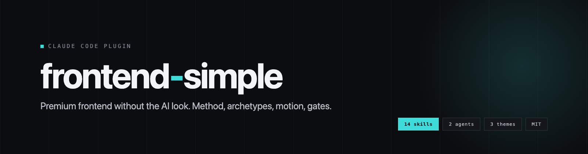
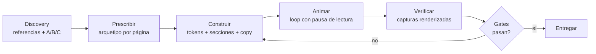
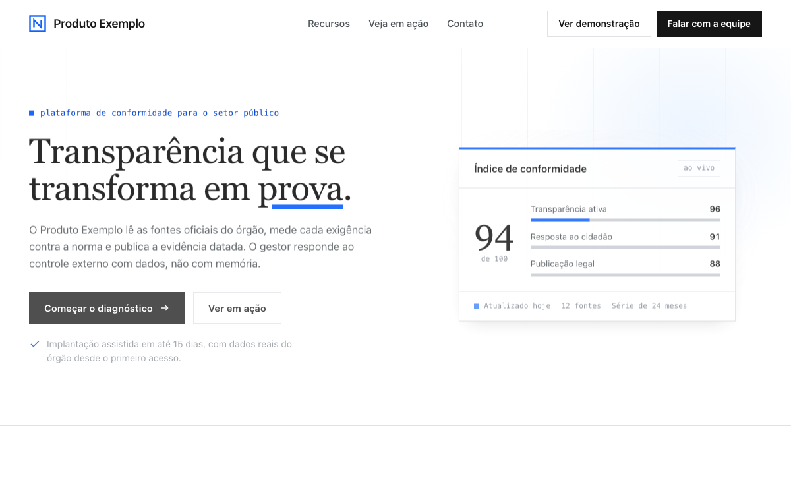
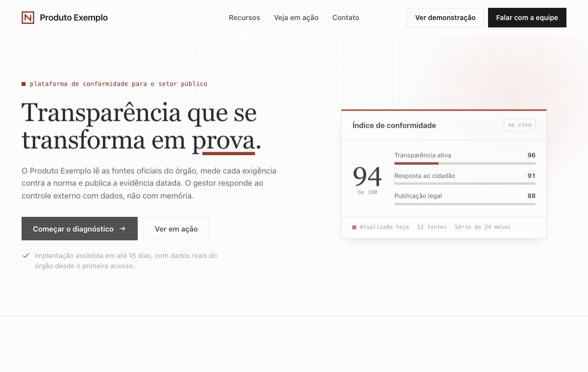
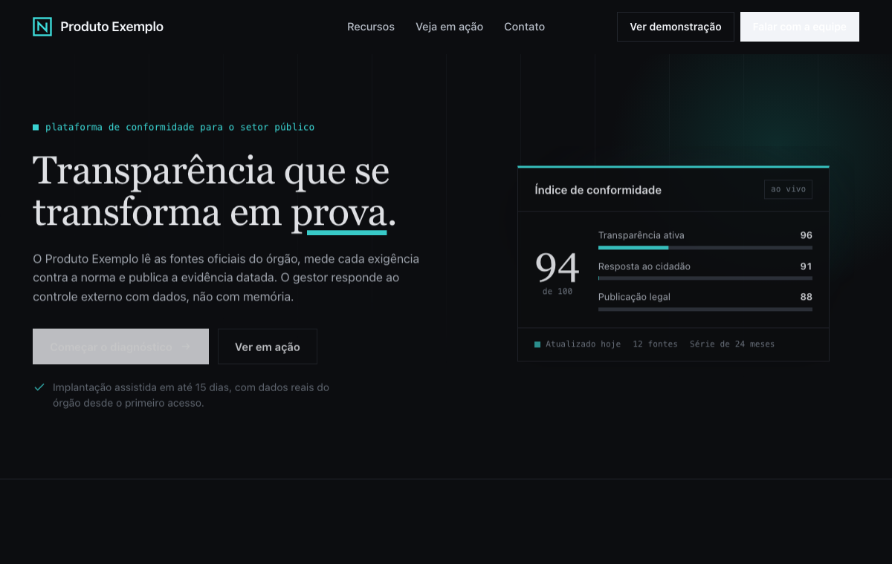

<div align="center">

[English](README.md) · [Português (BR)](README.pt-BR.md) · **Español**



[](https://github.com/SoberanusOnline/frontend-simple/actions/workflows/validate.yml)


**El método completo para construir sitios que no parecen generados por IA.**
Discovery con referencias, un arquetipo de composición por página,
blueprints de página, catálogos de secciones y fondos, tipografía premium,
animación en loop, copy enterprise, auditoría de de-slop y gates de
calidad estrictos.

</div>

---

## Índice

- [Por qué existe](#por-qué-existe)
- [Instalación](#instalación)
- [Cómo usarlo (solo habla)](#cómo-usarlo-solo-habla)
- [Cómo funciona el método](#cómo-funciona-el-método)
- [Qué hay dentro](#qué-hay-dentro)
- [Los 3 temas](#los-3-temas)
- [Funciona con tu agente](#funciona-con-tu-agente)
- [Actualizaciones](#actualizaciones)
- [Filosofía](#filosofía)
- [FAQ](#faq)

## Por qué existe

Nació de un proyecto real: **27 landing pages construidas a la vez**. La
mayor lección no fue estética, fue de proceso:

> **Los briefs abiertos producen clones. La identidad viene de la prescripción.**

El kit convierte eso en un método repetible: cada página recibe su propio
arquetipo de composición (de un catálogo que cubre 15 tipos de sitio),
cada sección sigue un blueprint en lugar de un reflejo, y nada llega al
usuario antes de pasar los gates: alineación, contraste, overflow, look
de IA.

## Instalación

### Claude Code (recomendado)

Un solo comando instala el plugin **y activa el auto-update**:

```bash
curl -fsSL https://raw.githubusercontent.com/SoberanusOnline/frontend-simple/main/install.sh | bash
```

<details>
<summary>Instalación manual / alcance de proyecto / web</summary>

Manual:

```bash
claude plugin marketplace add SoberanusOnline/frontend-simple
claude plugin install frontend-simple@frontend-simple
```

Para **Claude Code en la web** (claude.ai/code) y repos de equipo, instala
con alcance de proyecto para que la configuración viaje con el
repositorio:

```bash
claude plugin install frontend-simple@frontend-simple --scope project
git add .claude/settings.json && git commit -m "chore: add frontend-simple"
```

Luego reinicia Claude Code o ejecuta `/reload-plugins`.

</details>

### Codex, Cursor, Copilot, Antigravity y otros

El kit incluye **Agent Skills en el formato abierto SKILL.md**, que leen
Codex CLI, Gemini CLI, GitHub Copilot, Cursor, Windsurf, Cline y Google
Antigravity. Ver [Funciona con tu agente](#funciona-con-tu-agente).

## Cómo usarlo (solo habla)

No hace falta mencionar el plugin. Dilo a tu manera:

| Tú dices | El kit hace |
|---|---|
| "quiero un sitio para mi producto / restaurante / evento" | Discovery: pide tus referencias y muestra las direcciones A/B/C |
| "hazme un portafolio / blog / docs / dashboard" | Elige el tipo de sitio y prescribe un arquetipo antes de escribir código |
| "rediseña mi sitio" / "hazlo más premium" | Lee el sitio actual, conserva lo que importa y elimina el slop |
| "esto parece generado por IA" / "demasiado genérico" | Auditoría de de-slop: cada tell de 2026, cada uno con su corrección concreta |
| "algo está desalineado / se desborda" | Renderiza capturas, las lee, corrige y vuelve a pasar los gates |
| "búscame una fuente mejor / una paleta / iconos / referencias" | Fuentes vivas con licencias, no paquetes estancados |

Lo primero que hace en un proyecto nuevo: te pide **pegar capturas** de
sitios que te parezcan hermosos (o URLs), hace 4 preguntas cortas y
renderiza las **direcciones A, B y C** con tu contenido real, para que
elijas antes de que se construya nada.

## Cómo funciona el método



Siete pasos por página, y dos reglas de hierro: **el contenido es visible
sin JavaScript** (la animación realza, nunca oculta) y **nada se entrega
sin haberse visto renderizado** (desktop y móvil).

## Qué hay dentro

### 14 skills

| Skill | Qué cubre |
|---|---|
| `fs-build` | El método de 7 pasos, las frases disparadoras y el mapa de ruteo. Punto de entrada |
| `fs-discovery` | Capturas y URLs de referencia, 4 preguntas clave, direcciones A/B/C renderizadas |
| `fs-archetypes` | 15 tipos de sitio (landing, portafolio, blog, docs, dashboard, e-commerce, restaurante, evento, agencia...) con 3-5 arquetipos de hero con nombre cada uno, más el catálogo extendido de productos y la regla anti-clon |
| `fs-pages` | Blueprints de página: qué secciones necesita cada página y en qué orden (home, nosotros, precios, caso de estudio, post, 404...) |
| `fs-sections` | 8 patrones de navegación, 6 footers, 21 bloques de sección (features, prueba social, precios, FAQ, formularios, bandas de CTA) con el cliché a evitar en cada uno |
| `fs-backgrounds` | 12 recetas de fondo en CSS listo: campos de grilla, aurora washes, grain, matriz de puntos, foto + scrim, dark de terminal... |
| `fs-design-system` | Capas (base, marca, página), tokens `--fs-*`, CSS moderno (@layer, container queries, OKLCH) |
| `fs-typography` | Pareos intencionales, catálogo curado con licencias, fuentes variables self-hosted, escala fluida |
| `fs-sources` | Dónde buscar en vivo: 6 bibliotecas de fuentes, 7 fuentes de iconos (Iconify API, LobeHub...), 9 galerías de diseño, herramientas de color, fotos |
| `fs-motion` | Animación firma en loop con pausa de lectura, reveals a prueba de JS, animaciones scroll-driven, View Transitions |
| `fs-text-fx` | Coreografía de entrada de página y efectos de texto: split-line, word stagger, underline draw, count-up, scramble |
| `fs-copy` | Fórmulas de headline por tipo de sitio, microcopy (botones, formularios, errores, estados vacíos), esqueletos de formato, 5 presets de tono, jerarquía de CTA |
| `fs-deslop` | La auditoría "quita el look de IA": cada tell de diseño y de copy de 2026 con su corrección |
| `fs-quality` | Gates finales: las roturas clásicas, overflow en 4 anchos, contraste AA, enlaces e imágenes |

### 2 agents

| Agent | Rol |
|---|---|
| `fs-page-builder` | Construye una página desde un arquetipo prescrito. Uno por página, en paralelo, sin tocar nunca archivos compartidos |
| `fs-critic` | Crítico adversarial: caza slop, desalineación y roturas renderizando, y luego da el veredicto |

### Template starter funcional


`skills/fs-build/templates/starter/`: tokens, nav premium, footer de 4
columnas, un sistema de reveal que nunca oculta contenido sin JS, un
helper de loop con pausa y un servidor local sin caché.

## Los 3 temas

| enterprise-sharp | editorial | dark-tech |
|---|---|---|
|  |  |  |
| Esquinas rectas, gris frío, sans estructural | Off-white de verdad, serif display con propósito | Casi negro, mono, acento eléctrico |

Cada tema es un archivo de tokens: cámbialo, o deriva el tuyo desde la marca.

## Funciona con tu agente

Las skills usan el **estándar abierto SKILL.md**, y el repo también
incluye un [AGENTS.md](AGENTS.md) (el estándar multi-herramienta de la
Linux Foundation).

| Herramienta | Cómo |
|---|---|
| **Claude Code** | Plugin nativo: instalación arriba, auto-update, agents incluidos |
| **Codex CLI** | Copia `plugins/frontend-simple/skills/*` a tu carpeta de skills (normalmente `~/.codex/skills/`) |
| **Gemini CLI / Cline / Windsurf** | Igual: copia los directorios de skills a la carpeta de skills de la herramienta |
| **Cursor / Copilot / Antigravity** | Vendoriza el repo y apunta las reglas de tu proyecto al [AGENTS.md](AGENTS.md) |
| **ChatGPT / custom GPTs** | Adjunta los archivos SKILL.md como conocimiento; usa fs-build como instrucción principal |

> Las skills están escritas en portugués brasileño. Los modelos modernos
> las siguen con normalidad, sea cual sea el idioma de tu conversación.

## Actualizaciones

Versiones continuas: **cada push a este repositorio es una versión nueva.**

- Instalado con el instalador de un comando: el auto-update ya está
  activo. Claude Code descarga en segundo plano y te avisa; ejecuta
  `/reload-plugins`.
- Manual: `/plugin` > Marketplaces > frontend-simple > Enable auto-update,
  o actualiza bajo demanda:

```bash
claude plugin marketplace update frontend-simple
claude plugin update frontend-simple@frontend-simple
```

## Filosofía

1. **Referencias antes que código.** Nadie puede describir el sitio que
   quiere, pero todos reconocen lo que les parece hermoso.
2. **Un arquetipo por página.** La composición viene de lo que la cosa ES:
   un feed, un mapa, un menú, un caso, un documento.
3. **Fuentes vivas, no bibliotecas muertas.** El kit enseña dónde buscar y
   cómo traer material, con licencias verificadas.
4. **Contenido visible sin JS.** La animación realza; nunca oculta.
5. **Verificar renderizado.** Capturas antes de entregar, siempre, en
   ambos anchos.
6. **La especificidad mata el slop.** La corrección nunca es "darle más
   estilo": es anclar cada decisión en el dominio real.

## FAQ

**¿Funciona fuera de Claude Code?** Sí: el formato SKILL.md es un estándar
abierto que leen Codex, Gemini CLI, Copilot, Cursor, Windsurf, Cline y
Antigravity. Ver [Funciona con tu agente](#funciona-con-tu-agente).

**¿Puedo usar solo una parte?** Sí. Cada skill es autocontenida: ejecuta
solo `fs-deslop` sobre un sitio existente, o solo `fs-typography` para
fuentes.

**¿Cómo contribuyo?** Issues y PRs son bienvenidos. El CI valida manifests
y frontmatter, y hasta rechaza rayas en el contenido: el estándar se
aplica a sí mismo.

## Skills complementarias (opcional)

```bash
claude plugin marketplace add freshtechbro/claudedesignskills
claude plugin install gsap-scrolltrigger@claude-design-skillstack
```

Además de [impeccable](https://github.com/matteing/impeccable), cuyo
detector de antipatrones se usa como gate automático cuando está presente.

---

<div align="center">

Hecho por **NEXUS** · Licencia MIT · Úsalo, adáptalo y crea tus propias plantillas

</div>
