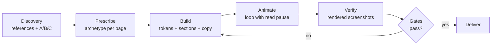

<div align="center">

**English** · [Português (BR)](README.pt-BR.md) · [Español](README.es.md)


[](https://github.com/SoberanusOnline/frontend-simple/actions/workflows/validate.yml)


**The complete method for building websites that do not look AI-generated.**
Discovery with references, one composition archetype per page, page
blueprints, section and background catalogs, premium typography, looped
motion, enterprise copy, de-slop auditing and hard quality gates.

</div>

---

## Table of contents

- [Why it exists](#why-it-exists)
- [Install](#install)
- [Use it (just talk)](#use-it-just-talk)
- [How the method works](#how-the-method-works)
- [What is inside](#what-is-inside)
- [The 3 themes](#the-3-themes)
- [Works with your agent](#works-with-your-agent)
- [Updates](#updates)
- [Philosophy](#philosophy)
- [FAQ](#faq)

## Why it exists

Born from a real project: **27 landing pages built at once**. The biggest
lesson was not aesthetic, it was process:

> **Open briefs produce clones. Identity comes from prescription.**

The kit turns that into a repeatable method: every page gets its own
composition archetype (from a catalog covering 15 site types), every
section follows a blueprint instead of a reflex, and nothing reaches the
user before passing the gates: alignment, contrast, overflow, AI-look.

## Install

### Claude Code (recommended)

One command installs the plugin **and turns auto-update on**:

```bash
curl -fsSL https://raw.githubusercontent.com/SoberanusOnline/frontend-simple/main/install.sh | bash
```

<details>
<summary>Manual install / project scope / web</summary>

Manual:

```bash
claude plugin marketplace add SoberanusOnline/frontend-simple
claude plugin install frontend-simple@frontend-simple
```

For **Claude Code on the web** (claude.ai/code) and team repos, install at
project scope so the config travels with the repository:

```bash
claude plugin install frontend-simple@frontend-simple --scope project
git add .claude/settings.json && git commit -m "chore: add frontend-simple"
```

Then restart Claude Code or run `/reload-plugins`.

</details>

### Codex, Cursor, Copilot, Antigravity and others

The kit ships **Agent Skills in the open SKILL.md format**, which is read
by Codex CLI, Gemini CLI, GitHub Copilot, Cursor, Windsurf, Cline and
Google Antigravity. See [Works with your agent](#works-with-your-agent).

## Use it (just talk)

No need to mention the plugin. Say it your way:

| You say | The kit does |
|---|---|
| "I want a website for my product / restaurant / event" | Discovery: asks for your references, then shows A/B/C directions |
| "build me a portfolio / blog / docs / dashboard" | Picks the site type and prescribes an archetype before coding |
| "redesign my site" / "make it more premium" | Reads the current site, keeps what matters, kills the slop |
| "this looks AI-generated" / "too generic" | De-slop audit: every 2026 tell, each with its concrete fix |
| "something is misaligned / overflowing" | Renders screenshots, reads them, fixes, re-gates |
| "find me a better font / a palette / icons / references" | Live sources with licensing, not stale bundles |

The first thing it does on a new project: asks you to **paste screenshots**
of sites you find beautiful (or URLs), asks 4 short questions, and renders
**directions A, B and C** with your real content so you choose before
anything is built.

## How the method works



Seven steps per page, and two iron rules: **content is visible without
JavaScript** (animation enhances, never hides) and **nothing ships without
being seen rendered** (desktop and mobile).

## What is inside

### 14 skills

| Skill | What it covers |
|---|---|
| `fs-build` | The 7-step method, trigger phrases, and the routing map. Entry point |
| `fs-discovery` | Reference screenshots and URLs, 4 key questions, rendered A/B/C directions |
| `fs-archetypes` | 15 site types (landing, portfolio, blog, docs, dashboard, e-commerce, restaurant, event, agency...) with 3-5 named hero archetypes each, plus the extended product catalog and the anti-clone rule |
| `fs-pages` | Page blueprints: which sections each page needs and in what order (home, about, pricing, case study, post, 404...) |
| `fs-sections` | 8 navigation patterns, 6 footers, 21 section blocks (features, proof, pricing, FAQ, forms, CTA bands) with the cliche to avoid in each |
| `fs-backgrounds` | 12 background recipes in ready CSS: grid fields, aurora washes, grain, dot matrix, photo + scrim, terminal dark... |
| `fs-design-system` | Layers (base, brand, page), `--fs-*` tokens, modern CSS (@layer, container queries, OKLCH) |
| `fs-typography` | Intentional pairings, curated licensed catalog, self-hosted variable fonts, fluid scale |
| `fs-sources` | Where to search live: 6 font libraries, 7 icon sources (Iconify API, LobeHub...), 9 design galleries, color tools, photos |
| `fs-motion` | Looped signature animation with a read pause, JS-proof reveals, scroll-driven animations, View Transitions |
| `fs-text-fx` | Page entrance choreography and text effects: split-line, word stagger, underline draw, count-up, scramble |
| `fs-copy` | Headline formulas per site type, microcopy (buttons, forms, errors, empty states), format skeletons, 5 tone presets, CTA hierarchy |
| `fs-deslop` | The "remove the AI look" audit: every 2026 design and copy tell with its fix |
| `fs-quality` | Final gates: the classic breakages, overflow at 4 widths, AA contrast, links and images |

### 2 agents

| Agent | Role |
|---|---|
| `fs-page-builder` | Builds one page from a prescribed archetype. One per page, in parallel, never touching shared files |
| `fs-critic` | Adversarial critic: hunts slop, misalignment and breakage by rendering, then gives the verdict |

### Working starter template


`skills/fs-build/templates/starter/`: tokens, premium nav, 4-column footer,
a reveal system that never hides content without JS, a loop-with-pause
helper and a no-cache local server.

## The 3 themes

| enterprise-sharp | editorial | dark-tech |
|---|---|---|
|  |  |  |
| Sharp corners, cool gray, structural sans | True off-white, display serif with purpose | Near-black, mono, electric accent |

Each theme is a token file: swap it, or derive your own from the brand.

## Works with your agent

The skills use the **open SKILL.md standard**, and the repo also ships an
[AGENTS.md](AGENTS.md) (the Linux Foundation cross-tool standard).

| Tool | How |
|---|---|
| **Claude Code** | Native plugin: install above, auto-update, agents included |
| **Codex CLI** | Copy `plugins/frontend-simple/skills/*` into your skills folder (typically `~/.codex/skills/`) |
| **Gemini CLI / Cline / Windsurf** | Same: copy the skill directories into the tool's skills folder |
| **Cursor / Copilot / Antigravity** | Vendor the repo and point your project rules at [AGENTS.md](AGENTS.md) |
| **ChatGPT / custom GPTs** | Attach the SKILL.md files as knowledge; use fs-build as the main instruction |

> The skills are written in Brazilian Portuguese. Modern models follow them
> regardless of your conversation language.

## Updates

Rolling versions: **every push to this repository is a new version.**

- Installed via the one-command installer: auto-update is already on.
  Claude Code fetches in the background and tells you; run `/reload-plugins`.
- Manual: `/plugin` > Marketplaces > frontend-simple > Enable auto-update,
  or update on demand:

```bash
claude plugin marketplace update frontend-simple
claude plugin update frontend-simple@frontend-simple
```

## Philosophy

1. **References before code.** Nobody can describe the site they want, but
   everyone recognizes what they find beautiful.
2. **One archetype per page.** Composition comes from what the thing IS:
   a feed, a map, a menu, a case, a document.
3. **Living sources, not dead libraries.** The kit teaches where to search
   and how to bring material in, with licensing checked.
4. **Content visible without JS.** Animation enhances; it never hides.
5. **Verify rendered.** Screenshots before delivery, always, both widths.
6. **Specificity kills slop.** The fix is never "style it more": it is
   anchoring every decision in the real domain.

## FAQ

**Does it work outside Claude Code?** Yes: the SKILL.md format is an open
standard read by Codex, Gemini CLI, Copilot, Cursor, Windsurf, Cline and
Antigravity. See [Works with your agent](#works-with-your-agent).

**Can I use just one part?** Yes. Every skill is self-contained: run only
`fs-deslop` on an existing site, or only `fs-typography` for fonts.

**How do I contribute?** Issues and PRs welcome. The CI validates manifests
and frontmatter, and even rejects em-dashes in content: the standard
applies to itself.

## Companion skills (optional)

```bash
claude plugin marketplace add freshtechbro/claudedesignskills
claude plugin install gsap-scrolltrigger@claude-design-skillstack
```

Plus [impeccable](https://github.com/matteing/impeccable), whose
anti-pattern detector is used as an automatic gate when present.

---

<div align="center">

Made by **NEXUS** · MIT License · Use it, adapt it, build your own templates

</div>
