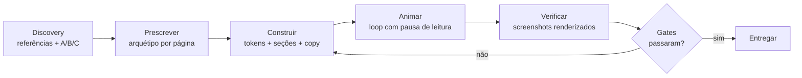

<div align="center">

[English](README.md) · **Português (BR)** · [Español](README.es.md)


[](https://github.com/SoberanusOnline/frontend-simple/actions/workflows/validate.yml)


**O método completo para construir sites que não parecem gerados por IA.**
Discovery com referências, um arquétipo de composição por página,
blueprints de página, catálogos de seções e fundos, tipografia premium,
animação em loop, copy enterprise, auditoria de de-slop e gates de
qualidade rígidos.

</div>

---

## Índice

- [Por que existe](#por-que-existe)
- [Instalação](#instalação)
- [Como usar (basta conversar)](#como-usar-basta-conversar)
- [Como o método funciona](#como-o-método-funciona)
- [O que tem dentro](#o-que-tem-dentro)
- [Os 3 temas](#os-3-temas)
- [Funciona com o seu agente](#funciona-com-o-seu-agente)
- [Atualizações](#atualizações)
- [Filosofia](#filosofia)
- [FAQ](#faq)

## Por que existe

Nasceu de um projeto real: **27 landing pages construídas de uma vez**. A
maior lição não foi estética, foi de processo:

> **Briefs abertos produzem clones. Identidade vem de prescrição.**

O kit transforma isso em um método repetível: cada página ganha seu
próprio arquétipo de composição (de um catálogo que cobre 15 tipos de
site), cada seção segue um blueprint em vez de um reflexo, e nada chega ao
usuário antes de passar pelos gates: alinhamento, contraste, overflow,
cara de IA.

## Instalação

### Claude Code (recomendado)

Um comando instala o plugin **e já liga o auto-update**:

```bash
curl -fsSL https://raw.githubusercontent.com/SoberanusOnline/frontend-simple/main/install.sh | bash
```

<details>
<summary>Instalação manual / escopo de projeto / web</summary>

Manual:

```bash
claude plugin marketplace add SoberanusOnline/frontend-simple
claude plugin install frontend-simple@frontend-simple
```

Para o **Claude Code na web** (claude.ai/code) e repositórios de time,
instale no escopo de projeto para a configuração viajar junto com o
repositório:

```bash
claude plugin install frontend-simple@frontend-simple --scope project
git add .claude/settings.json && git commit -m "chore: add frontend-simple"
```

Depois reinicie o Claude Code ou rode `/reload-plugins`.

</details>

### Codex, Cursor, Copilot, Antigravity e outros

O kit traz **Agent Skills no formato aberto SKILL.md**, que é lido por
Codex CLI, Gemini CLI, GitHub Copilot, Cursor, Windsurf, Cline e Google
Antigravity. Veja [Funciona com o seu agente](#funciona-com-o-seu-agente).

## Como usar (basta conversar)

Não precisa citar o plugin. Fale do seu jeito:

| Você diz | O kit faz |
|---|---|
| "quero um site para meu produto / restaurante / evento" | Discovery: pede suas referências e mostra as direções A/B/C |
| "monta um portfólio / blog / docs / dashboard" | Escolhe o tipo de site e prescreve um arquétipo antes de codar |
| "redesenha meu site" / "deixa mais premium" | Lê o site atual, mantém o que importa e elimina o slop |
| "isso parece gerado por IA" / "muito genérico" | Auditoria de de-slop: cada tell de 2026, cada um com sua correção concreta |
| "tem algo desalinhado / estourando" | Renderiza screenshots, lê, corrige e roda os gates de novo |
| "acha uma fonte melhor / uma paleta / ícones / referências" | Fontes vivas com licenciamento, não pacotes parados |

A primeira coisa que ele faz em um projeto novo: pede para você **colar
screenshots** de sites que você acha bonitos (ou URLs), faz 4 perguntas
curtas e renderiza as **direções A, B e C** com o seu conteúdo real, para
você escolher antes de qualquer coisa ser construída.

## Como o método funciona



Sete passos por página, e duas regras de ferro: **o conteúdo é visível sem
JavaScript** (animação realça, nunca esconde) e **nada é entregue sem ser
visto renderizado** (desktop e mobile).

## O que tem dentro

### 14 skills

| Skill | O que cobre |
|---|---|
| `fs-build` | O método de 7 passos, as frases-gatilho e o mapa de roteamento. Ponto de entrada |
| `fs-discovery` | Screenshots e URLs de referência, 4 perguntas-chave, direções A/B/C renderizadas |
| `fs-archetypes` | 15 tipos de site (landing, portfólio, blog, docs, dashboard, e-commerce, restaurante, evento, agência...) com 3-5 arquétipos de hero nomeados cada, mais o catálogo estendido de produtos e a regra anti-clone |
| `fs-pages` | Blueprints de página: quais seções cada página precisa e em que ordem (home, sobre, preços, case, post, 404...) |
| `fs-sections` | 8 padrões de navegação, 6 footers, 21 blocos de seção (features, prova, preços, FAQ, formulários, faixas de CTA) com o clichê a evitar em cada um |
| `fs-backgrounds` | 12 receitas de fundo em CSS pronto: campos de grid, lavagens aurora, grain, matriz de pontos, foto + scrim, dark de terminal... |
| `fs-design-system` | Camadas (base, marca, página), tokens `--fs-*`, CSS moderno (@layer, container queries, OKLCH) |
| `fs-typography` | Pareamentos intencionais, catálogo curado com licença, fontes variáveis self-hosted, escala fluida |
| `fs-sources` | Onde buscar ao vivo: 6 bibliotecas de fontes, 7 fontes de ícones (Iconify API, LobeHub...), 9 galerias de design, ferramentas de cor, fotos |
| `fs-motion` | Animação-assinatura em loop com pausa de leitura, reveals à prova de JS, animações scroll-driven, View Transitions |
| `fs-text-fx` | Coreografia de entrada de página e efeitos de texto: split-line, word stagger, underline draw, count-up, scramble |
| `fs-copy` | Fórmulas de headline por tipo de site, microcopy (botões, formulários, erros, estados vazios), esqueletos de formato, 5 presets de tom, hierarquia de CTA |
| `fs-deslop` | A auditoria "remova a cara de IA": cada tell de design e de copy de 2026 com sua correção |
| `fs-quality` | Gates finais: as quebras clássicas, overflow em 4 larguras, contraste AA, links e imagens |

### 2 agents

| Agent | Papel |
|---|---|
| `fs-page-builder` | Constrói uma página a partir de um arquétipo prescrito. Um por página, em paralelo, sem nunca tocar em arquivos compartilhados |
| `fs-critic` | Crítico adversarial: caça slop, desalinhamento e quebra renderizando, e depois dá o veredito |

### Template starter funcional


`skills/fs-build/templates/starter/`: tokens, nav premium, footer de 4
colunas, um sistema de reveal que nunca esconde conteúdo sem JS, um helper
de loop com pausa e um servidor local sem cache.

## Os 3 temas

| enterprise-sharp | editorial | dark-tech |
|---|---|---|
|  |  |  |
| Cantos retos, cinza frio, sans estrutural | Off-white de verdade, serif display com propósito | Quase preto, mono, acento elétrico |

Cada tema é um arquivo de tokens: troque, ou derive o seu a partir da marca.

## Funciona com o seu agente

As skills usam o **padrão aberto SKILL.md**, e o repo também traz um
[AGENTS.md](AGENTS.md) (o padrão cross-tool da Linux Foundation).

| Ferramenta | Como |
|---|---|
| **Claude Code** | Plugin nativo: instalação acima, auto-update, agents incluídos |
| **Codex CLI** | Copie `plugins/frontend-simple/skills/*` para a sua pasta de skills (normalmente `~/.codex/skills/`) |
| **Gemini CLI / Cline / Windsurf** | Igual: copie os diretórios das skills para a pasta de skills da ferramenta |
| **Cursor / Copilot / Antigravity** | Vendorize o repo e aponte as regras do seu projeto para o [AGENTS.md](AGENTS.md) |
| **ChatGPT / custom GPTs** | Anexe os arquivos SKILL.md como conhecimento; use fs-build como instrução principal |

> As skills já são escritas em português brasileiro, o idioma nativo do
> kit: você usa tudo direto, sem nada se perder na tradução.

## Atualizações

Versões contínuas: **cada push neste repositório é uma versão nova.**

- Instalado pelo instalador de um comando: o auto-update já vem ligado.
  O Claude Code baixa em segundo plano e avisa; rode `/reload-plugins`.
- Manual: `/plugin` > Marketplaces > frontend-simple > Enable auto-update,
  ou atualize sob demanda:

```bash
claude plugin marketplace update frontend-simple
claude plugin update frontend-simple@frontend-simple
```

## Filosofia

1. **Referências antes de código.** Ninguém consegue descrever o site que
   quer, mas todo mundo reconhece o que acha bonito.
2. **Um arquétipo por página.** A composição vem do que a coisa É:
   um feed, um mapa, um cardápio, um case, um documento.
3. **Fontes vivas, não bibliotecas mortas.** O kit ensina onde buscar e
   como trazer material, com licenciamento verificado.
4. **Conteúdo visível sem JS.** Animação realça; nunca esconde.
5. **Verifique renderizado.** Screenshots antes da entrega, sempre, nas
   duas larguras.
6. **Especificidade mata o slop.** A correção nunca é "estilizar mais": é
   ancorar cada decisão no domínio real.

## FAQ

**Funciona fora do Claude Code?** Sim: o formato SKILL.md é um padrão
aberto lido por Codex, Gemini CLI, Copilot, Cursor, Windsurf, Cline e
Antigravity. Veja [Funciona com o seu agente](#funciona-com-o-seu-agente).

**Posso usar só uma parte?** Sim. Cada skill é autocontida: rode só o
`fs-deslop` em um site existente, ou só o `fs-typography` para fontes.

**Como contribuo?** Issues e PRs são bem-vindos. O CI valida manifests e
frontmatter, e até rejeita travessão no conteúdo: o padrão se aplica a si
mesmo.

## Skills complementares (opcional)

```bash
claude plugin marketplace add freshtechbro/claudedesignskills
claude plugin install gsap-scrolltrigger@claude-design-skillstack
```

Além do [impeccable](https://github.com/matteing/impeccable), cujo
detector de anti-padrões é usado como gate automático quando presente.

---

<div align="center">

Feito pela **NEXUS** · Licença MIT · Use, adapte e crie seus próprios templates

</div>
