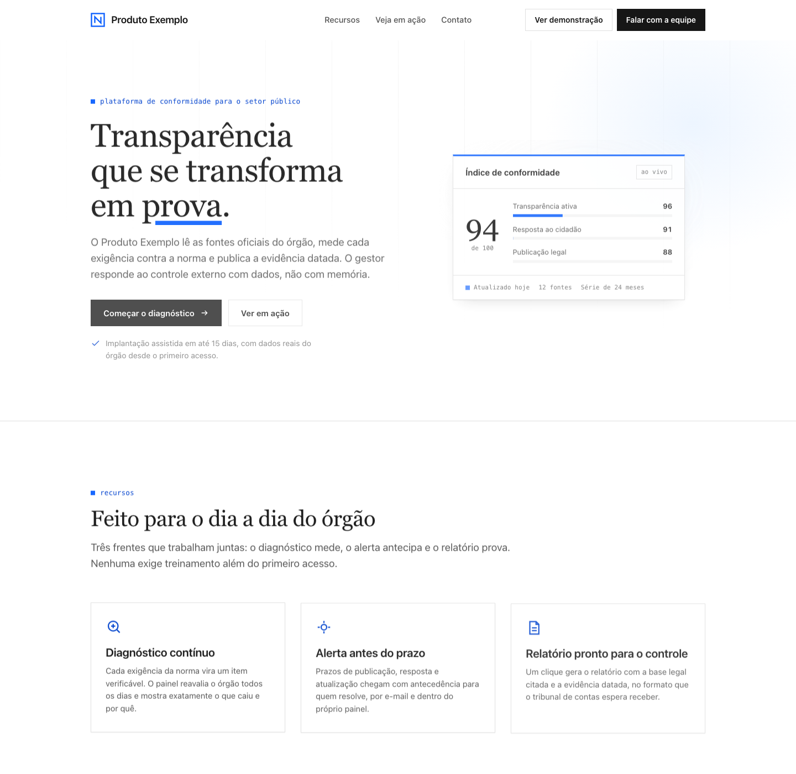

<div align="center">

[English](README.md) · **Português (BR)** · [Español](README.es.md)

# frontend-simple

**Frontend premium sem cara de IA.**

Metodo completo para criar sites e paginas web com identidade propria:
descoberta com referencias, arquetipos de composicao, design system em
camadas, tipografia premium, motion em loop, copy enterprise, auditoria
de-slop e gates de qualidade.

[](https://github.com/SoberanusOnline/frontend-simple/actions/workflows/validate.yml)




*O template starter do kit, do jeito que sai da caixa.*

</div>

---

## Por que existe

Nasceu de um projeto real: 27 landing pages construidas de uma vez. A maior
licao nao foi estetica, foi de processo: **brief aberto gera clones;
identidade vem de prescricao.** O kit transforma isso em metodo: cada pagina
ganha um arquetipo proprio de composicao, e nada chega ao usuario sem passar
pelos gates (alinhamento, contraste, overflow, cara de IA).

## Instalar

### Claude Code (terminal) recomendado

Um comando: instala e ja deixa o **auto-update ligado**.

```bash
curl -fsSL https://raw.githubusercontent.com/SoberanusOnline/frontend-simple/main/install.sh | bash
```

Prefere manual?

```bash
claude plugin marketplace add SoberanusOnline/frontend-simple
claude plugin install frontend-simple@frontend-simple
```

Depois reinicie o Claude Code (ou rode `/reload-plugins`).

### Claude Code na web (claude.ai/code)

Instale no escopo do PROJETO dentro de um repositorio. A configuracao vai
para `.claude/settings.json`, viaja no commit, e o plugin carrega tambem nas
sessoes web daquele repositorio (e para todo colaborador que confiar no repo):

```bash
claude plugin install frontend-simple@frontend-simple --scope project
git add .claude/settings.json && git commit -m "chore: frontend-simple no projeto"
```

### Codex, ChatGPT, Cursor e outros agentes

Todo o conhecimento do kit e Markdown puro. Veja o [AGENTS.md](AGENTS.md):
clone o repositorio e aponte o agente para os `SKILL.md`. No ChatGPT, anexe
os arquivos como conhecimento de um GPT personalizado.

## Usar

Nao precisa citar o plugin. Fale natural:

> "quero fazer um site para meu produto"
> "preciso de uma pagina web pro lancamento"
> "monta um portfolio pra mim"
> "esse site ta com cara de IA, arruma"

O kit assume: pede suas referencias (**cole prints** de sites que voce acha
bonitos, ou mande URLs), faz as 4 perguntas que importam e te mostra
**direcoes A/B/C renderizadas** para escolher antes de construir. So depois
constroi, com verificacao visual e gates antes de te mostrar.

## Como chegam as atualizacoes

Simples: **a gente publica neste repositorio (push) e pronto**. O plugin usa
versao rolante: cada atualizacao aqui no GitHub ja e uma versao nova.

- Instalou pelo **instalador de um comando**: auto-update ja esta ligado.
  O Claude Code baixa em background e avisa; basta rodar `/reload-plugins`.
- Instalou **manual**: ligue uma vez (`/plugin` > Marketplaces >
  frontend-simple > Enable auto-update) ou atualize quando quiser:

```bash
claude plugin marketplace update frontend-simple
claude plugin update frontend-simple@frontend-simple
```

## O que vem dentro

### 10 skills

| Skill | O que faz |
|---|---|
| `fs-build` | O metodo completo em 7 passos, do briefing ao gate final. Porta de entrada; roteia as demais |
| `fs-discovery` | Descoberta com o usuario: prints e URLs de referencia, 4 perguntas certas, direcoes A/B/C renderizadas |
| `fs-archetypes` | Catalogo de ~27 arquetipos de hero (MEDIDOR, FEED AO VIVO, MAPA, CADEIA, DOSSIE, PORTAL, DIARIO...) e a regra anti-clone |
| `fs-design-system` | Camadas (base, marca, pagina), tokens `--fs-*`, 3 temas, CSS moderno (@layer, container queries, OKLCH) |
| `fs-typography` | Pares com intencao, catalogo curado com licenca, self-host de variable fonts, escala fluida |
| `fs-sources` | Onde buscar ao vivo: 6 acervos de fontes, 7 de icones (Iconify API, LobeHub...), 9 galerias de referencia, cores, fotos |
| `fs-motion` | Assinatura em loop com pausa, reveal blindado sem JS, scroll-driven animations e View Transitions |
| `fs-copy` | Voz enterprise: headlines com tensao real, estrutura de hero, o que nunca escrever |
| `fs-deslop` | Auditoria "tirar cara de IA": os tells de design e copy de 2026, cada um com correcao |
| `fs-quality` | Gates finais: alinhamento (os "tortos" classicos), overflow, contraste AA, links e imagens |

### 2 agents

| Agent | O que faz |
|---|---|
| `fs-page-builder` | Constroi uma pagina a partir de um arquetipo prescrito. Um por pagina, em paralelo |
| `fs-critic` | Critico adversario: caca slop, tortos e quebras por renderizacao antes da entrega |

### Template starter e 3 temas

`skills/fs-build/templates/starter/` e uma pagina FUNCIONAL (a do print acima):
tokens, nav premium, footer 4 colunas, sistema de reveal que nunca esconde
conteudo sem JS, helper de loop com pausa e servidor local sem cache.
`templates/themes/`: enterprise-sharp, editorial e dark-tech como pontos de
partida de identidade.

## Filosofia

1. **Referencia antes de codigo.** Ninguem descreve o site que quer, mas todo
   mundo reconhece o que acha bonito. A descoberta transforma isso em direcao.
2. **Arquetipo por pagina.** A composicao nasce do que o produto E (um feed,
   um mapa, um documento, uma cadeia), nunca de um template.
3. **Fonte viva, nao biblioteca morta.** O kit ensina onde buscar (fontes,
   cores, referencias, icones) e como trazer, em vez de embarcar acervos.
4. **Conteudo visivel sem JS.** Animacao realca; nunca esconde.
5. **Verificar renderizado.** Screenshot antes de entregar, sempre.
6. **Especificidade mata slop.** No design e na copy, a correcao nunca e
   "estilizar mais": e ancorar cada decisao no dominio real.

## Perguntas rapidas

**Funciona fora do Claude Code?** Sim. As skills sao Markdown puro: Codex,
Cursor e afins usam via [AGENTS.md](AGENTS.md); no ChatGPT, como conhecimento
de um GPT. O que e exclusivo do Claude Code: instalacao nativa, auto-update e
os 2 agents como subagentes automaticos.

**Posso usar so uma parte?** Sim. Cada skill e autossuficiente: da para
invocar so o `fs-deslop` num site existente, ou so o `fs-typography`.

**Como contribuo?** Abra uma issue ou PR. O CI valida manifests, frontmatter
e ate proibe travessao no conteudo (o padrao se aplica a si mesmo).

## Skills companheiras (recomendadas)

```bash
claude plugin marketplace add freshtechbro/claudedesignskills
claude plugin install gsap-scrolltrigger@claude-design-skillstack
```

E o [impeccable](https://github.com/matteing/impeccable), cujo detector de
anti-padroes e usado como gate automatico quando presente.

---

<div align="center">

Feito pela **NEXUS** · Licenca MIT · Use, adapte e crie os seus proprios templates

</div>
